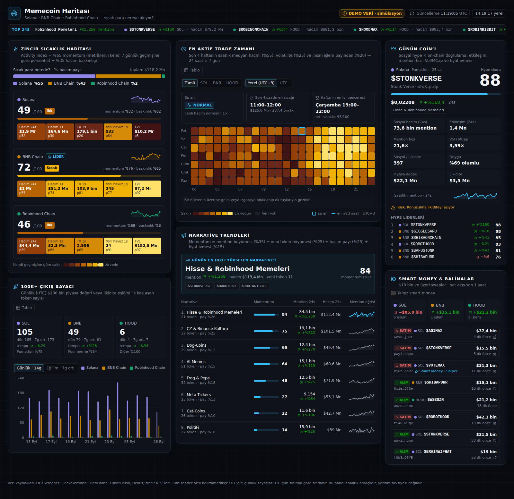

# Memecoin Haritası

**Solana, BNB Chain ve Robinhood Chain için memecoin ısı haritası ve aktivite analitiği.**
Sıcak paranın hangi zincire aktığını, günde kaç token'ın $100K eşiğini aştığını, günün en çok
konuşulan coin'ini ve narrative'ini, trade için en yoğun saatleri tek ekranda gösterir.



*Ekran görüntüsü demo modundandır; token adları ve rakamlar simülasyondur.*

## Özellikler

| Modül | Ne gösterir | Algoritma |
| --- | --- | --- |
| **Zincir Sıcaklık Haritası** | 3 zincir için 0–100 Activity Index; hacim (24s/1s), işlem sayısı, yeni havuz, TVL ısı hücreleri; 1 saatlik hacim payı ("sıcak para nerede?") | Kendi 7 günlük geçmişine göre persentil momentumu (%65) + hacim baskınlığı (%35) |
| **100K+ Çıkış Sayacı** | Günlük (UTC) $100K piyasa değeri/likidite eşiğini ilk kez aşan token sayısı; bugünün temposu, 14 günlük karşılaştırmalı çubuk grafik, 30 günlük eğilim | 2 ardışık örnekle onay, manipülasyon filtresi, launchpad'den bağımsız |
| **Günün Coin'i & Narrative** | Hype skoru en yüksek token; sosyal hacim, Vol/MCap, sosyal/likidite oranı, risk bayrakları; en hızlı yükselen narrative | Etkileşim, mention hızı, devir ve fiyat ivmesinin persentil ağırlıklı toplamı |
| **En Aktif Trade Zamanı** | 24 saat × 7 gün ısı matrisi, "şu an aktif mi?", son 4 saatin en sıcağı, haftanın en iyi 3 saatlik penceresi (yerel saat / UTC) | 4 haftalık medyan hacim + volatilite + insan işlem payı |
| **Smart Money & Balinalar** | $10K+ swaplar, smart money etiketleri, zincir başına 1 saatlik net akış | Helius webhook + EVM `Swap` logları |

Ayrıntılar: [docs/MIMARI.md](docs/MIMARI.md) (sistem mimarisi, veri akışı, önbellek, veritabanı,
API planı) · [docs/ALGORITMALAR.md](docs/ALGORITMALAR.md) (formüller ve pseudo-code).

## Hızlı başlangıç (demo modu, anahtar gerekmez)

Node.js 20.9 veya üstü gerekir.

```sh
npm install
npm run dev
```

http://localhost:3000 adresini açın. Demo modu, tohumlanmış bir piyasa simülatörünün ürettiği ham
veriyi **gerçek analitik hattından** geçirir: index, matris ve hype skorları canlı moddaki kodla
aynı fonksiyonlarla hesaplanır. Başlıkta "DEMO VERİ" rozeti görünür.

## Canlı mod

```sh
docker compose up -d                 # PostgreSQL 16 + Redis 7
cp .env.example .env                 # DATA_MODE=live yapın, anahtarları doldurun
npm run db:deploy                    # migration'ları uygula
npm run db:seed                      # (opsiyonel) 5 haftalık demo geçmişi yükle
npm run worker                       # veri toplayıcı (ayrı terminalde)
npm run build && npm start           # web
```

Worker, sağlayıcılardan veri toplar, PostgreSQL'e yazar ve 30 saniyede bir hazır snapshot'ı Redis'e
koyar. Web katmanı yalnızca bu snapshot'ı okur.

| Ortam değişkeni | Gerekli mi | Açıklama |
| --- | --- | --- |
| `DATA_MODE` | — | `demo` (varsayılan) veya `live` |
| `DATABASE_URL`, `REDIS_URL` | canlı | Altyapı |
| `LUNARCRUSH_API_KEY` | opsiyonel | Sosyal metrikler; yoksa sosyal job atlanır |
| `HELIUS_WEBHOOK_SECRET` | opsiyonel | Solana balina swapları için webhook yetkilendirmesi |
| `BSC_RPC_URL`, `ROBINHOOD_RPC_URL` | opsiyonel | EVM balina taraması |
| `ROBINHOOD_*` | kontrol edin | Robinhood Chain sağlayıcı kimlikleri (aşağıya bakın) |
| `MILESTONE_USD`, `WHALE_MIN_USD`, `BOT_TX_PER_HOUR` | — | Eşikler |

Tam liste: [`.env.example`](.env.example). Helius webhook'u için: Helius panelinde "enhanced"
türünde bir webhook oluşturun, URL olarak `https://<alan-adınız>/api/webhooks/helius` girin, hesap
listesine takip edilen token mint'lerini ekleyin ve "Authorization header" alanına
`HELIUS_WEBHOOK_SECRET` değerini yazın.

## Komutlar

| Komut | Açıklama |
| --- | --- |
| `npm run dev` | Geliştirme sunucusu |
| `npm run build` / `npm start` | Üretim derlemesi / sunucusu |
| `npm run worker` | Veri toplama worker'ı |
| `npm test` | Birim testleri (Vitest) |
| `TEST_DATABASE_URL=… npm test` | PostgreSQL'e karşı entegrasyon testleri de çalışır (veritabanı `prisma migrate deploy` ile hazırlanmalı; test tabloları temizler) |
| `npm run typecheck` | TypeScript kontrolü |
| `npm run db:migrate` / `db:deploy` / `db:seed` | Prisma migration'ları ve demo verisi |

## Proje yapısı

```
prisma/
  schema.prisma            Token, ChainStats, VolumeByHour, SocialMetrics, LaunchDaily, WhaleTrade, …
  migrations/              SQL migration'ları
  seed.ts                  Demo geçmişini veritabanına yükler
src/
  app/                     Next.js App Router: sayfa + /api/dashboard, /api/health, /api/webhooks/helius
  components/dashboard/    Panel bileşenleri (ısı haritası, 100K sayacı, 24x7 matris, …)
  components/ui/           Ortak UI parçaları (Panel, Sparkline, Meter, …)
  lib/analytics/           Saf algoritmalar: activityIndex, milestones, tradeWindows, hype,
                           narratives, whales, snapshot
  lib/                     Zincir tanımları, tipler, biçimlendirme, tema
  server/providers/        DEXScreener, GeckoTerminal, DefiLlama, LunarCrush, Helius, EVM adaptörleri
  server/jobs/             Worker job'ları
  server/snapshot/         PostgreSQL → snapshot, önbellekli okuma
  server/simulation.ts     Demo modu piyasa simülatörü
  worker/index.ts          Worker giriş noktası ve job takvimi
tests/                     Birim + entegrasyon testleri
```

## Arayüz ve tasarım kararları

- **Koyu, terminal tarzı arayüz:** paneller, ince ızgara dokusu, tablo hizalı rakamlar. Metin renkleri
  panel yüzeyinde en az 4,5:1 kontrastlıdır.
- **Zincir renkleri** (Solana mor, BNB sarı, Robinhood aqua) koyu yüzeyde renk körlüğü simülasyonu
  (ΔE ≥ 8), normal görüş ayrımı (ΔE ≥ 15) ve ≥ 3:1 kontrast kontrollerinden geçen doğrulanmış
  kategorik palettir. Zincir kimliği hiçbir yerde yalnızca renkle verilmez; her zaman ad veya kısaltma
  da yazılır.
- **Isı rampası** koyu bordodan sarıya giden, açıklığı düzenli artan tek bir ölçektir. Düşük değerler
  panel yüzeyine doğru kaybolur. Hücre değerleri metin olarak da yazılır.
- Her grafiğin **tablo görünümü** vardır. 24x7 matris ok tuşlarıyla gezilebilir; hücre açıklamaları
  ekran okuyuculara duyurulur.
- Sayılar belirsizlik olmasın diye `$340 bin · $1,2 Mn · $12,3 Mr` biçimindedir. Türkçedeki "B"
  (bin) kısaltması kriptoda "billion" ile karışacağı için kullanılmaz.
- Masaüstünde 3 sütun, tablette 2, telefonda 1 sütun; sayfada yatay kaydırma yoktur.

## Doğrulanmamış varsayımlar

- **Robinhood Chain kimlikleri.** Robinhood Chain'in DEXScreener / GeckoTerminal / DefiLlama
  kimlikleri ve zincir kimliği `ROBINHOOD_*` ortam değişkenlerinden okunur. Varsayılan değerler
  (`robinhood`) tahmindir; canlıya almadan önce sağlayıcı belgelerinden doğrulayın. Kimlik yanlışsa
  panel o zincir için "veri yok" kartı gösterir, sıfır aktivite göstermez.
- **Sağlayıcı yanıt biçimleri.** Adaptörler sağlayıcıların belgelenmiş yanıt biçimlerine göre yazıldı
  ve bu biçimleri taklit eden fikstürlerle test edildi. Geliştirme ortamında dış API'lere ağ erişimi
  olmadığı için canlı yanıtlarla denenmedi. Her yanıt şema doğrulamasından geçer; biçim farklıysa
  job hatayı log'lar, sessizce yanlış veri yazmaz. LunarCrush alan adları özellikle kontrol edilmeli.
- **Launchpad sezgileri.** Pump.fun adresleri `…pump`, Four.meme adresleri `…4444` son ekiyle ve
  DEX kimlikleriyle tanınır (`src/lib/analytics/launchpads.ts`). Bu yalnızca kırılımı etkiler,
  100K sayımını etkilemez.
- **Yeni havuz sayısı** GeckoTerminal'in sayfalı akışından geldiği için yoğun saatlerde bir alt
  sınırdır. Kesin sayım için önerilen genişlemeler: bkz. [MIMARI.md §5](docs/MIMARI.md#5-veri-kaynakları-ve-api-entegrasyon-planı).

---

Bu panel analitik amaçlıdır, yatırım tavsiyesi değildir.
