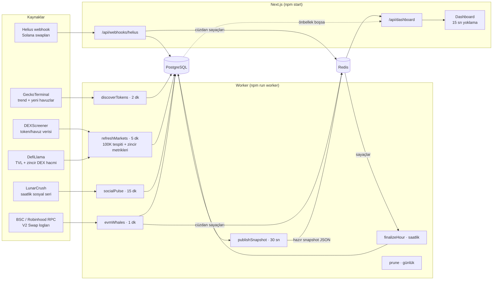

# Sistem Mimarisi ve Veri Akışı

Bu belge, Memecoin Haritası'nın verileri nereden aldığını, nasıl işlediğini, nerede sakladığını
ve panele nasıl ulaştırdığını açıklar. Algoritmaların formülleri için bkz.
[ALGORITMALAR.md](./ALGORITMALAR.md).

## 1. Genel bakış



İlke: **web katmanı istek başına analitik sorgu çalıştırmaz.** Worker, PostgreSQL'deki ham
veriden 30 saniyede bir tek bir `DashboardSnapshot` JSON'u üretip Redis'e yazar. `/api/dashboard`
bu JSON'u olduğu gibi döner. Böylece 1 kullanıcı da 10.000 kullanıcı da veritabanına aynı yükü
bindirir.

### Bileşenler

| Bileşen | Sorumluluk | Ölçekleme |
| --- | --- | --- |
| **Next.js web** | Dashboard'u sunucu tarafında ilk veriyle render eder, `/api/dashboard` ve webhook uçlarını sunar | Durumsuz; yatayda çoğaltılabilir |
| **Worker** | Sağlayıcılardan veri toplar, 100K tespiti ve metrikleri hesaplar, snapshot yayınlar | Birden çok kopya çalışabilir; job'lar Redis kilidiyle tekilleşir |
| **PostgreSQL** | Kalıcı gerçek kaynağı (token evreni, saatlik seriler, sosyal metrikler, balina işlemleri) | Zaman serisi tabloları için TimescaleDB önerilir (bkz. §4) |
| **Redis** | Hazır snapshot, job kilitleri, saatlik cüzdan sayaçları, sağlayıcı önbelleği | Tek örnek yeterli; kalıcılık gerekmez |

### Snapshot hattı: tek analitik yol

```
PostgreSQL ──loadRawFromDb──▶ RawDashboardData ──buildSnapshot──▶ DashboardSnapshot
Simülatör  ──simulateRawData─▶ RawDashboardData ──buildSnapshot──▶ DashboardSnapshot
```

`buildSnapshot` (`src/lib/analytics/snapshot.ts`) saf bir fonksiyondur: Activity Index, 24x7 matris,
hype skorları, narrative momentumu ve balina akışı burada hesaplanır. Demo modu da aynı fonksiyonu
simülatörden gelen ham veriyle çağırır. Yani demo, analitik kodun canlı ortamdaki davranışını
birebir gösterir. Bu eşdeğerlik test edilmiştir: seed edilmiş veritabanından okunan snapshot ile
simülatörden üretilen snapshot aynıdır.

## 2. Job takvimi

Zamanlayıcı (`src/server/scheduler.ts`) duvar saatine hizalıdır ve her job için Redis'te
`SET NX PX` kilidi alır. İki worker kopyası aynı job'u aynı anda çalıştıramaz; bir job bir önceki
çalışması bitmeden de yeniden başlamaz.

| Job | Periyot | Kaynak | Yazdığı yer | Ne yapar |
| --- | --- | --- | --- | --- |
| `discoverTokens` | 2 dk (+10 sn) | GeckoTerminal `trending_pools` (2 sayfa) + `new_pools` (3 sayfa), 3 zincir | `tokens` | Günün aktif coin'lerini ve yeni açılan token'ları ekler; WSOL/USDC/WBNB gibi memecoin olmayanları eler; launchpad ve narrative etiketlerini atar |
| `refreshMarkets` | 5 dk (+30 sn) | DEXScreener `tokens/v1` (30'arlı), DefiLlama | `tokens`, `volume_by_hour`, `chain_stats`, `launch_daily` | Piyasa verisini yeniler, 100K eşiğini ilerletir, saatlik zincir satırlarını ve Activity Index'i yazar |
| `evmWhales` | 1 dk (+5 sn) | BSC / Robinhood RPC `eth_getLogs` | `whale_trades`, Redis sayaçları | V2 `Swap` loglarından balina swaplarını ve cüzdan aktivitesini çıkarır |
| `socialPulse` | 15 dk (+3 dk) | LunarCrush topic time-series | `social_metrics` | İlk 40 token'ın saatlik mention/etkileşim/duygu serisini yazar |
| `finalizeHour` | saatlik (+90 sn) | Redis cüzdan sayaçları | `volume_by_hour` | Biten saatin bot/insan işlem ayrımını yazar |
| `publishSnapshot` | 30 sn (+15 sn) | PostgreSQL | Redis `dash:snapshot:v1` | Dashboard JSON'unu üretir |
| `prune` | günlük 03:00 UTC | — | tüm tablolar | Saklama politikasını uygular |

Solana swapları push tabanlıdır: Helius webhook'u `/api/webhooks/helius` ucuna gelir,
`Authorization` başlığı sabit zamanlı karşılaştırmayla doğrulanır.

## 3. Önbellek stratejisi (Redis)

| Anahtar | Tür | TTL | Amaç |
| --- | --- | --- | --- |
| `dash:snapshot:v1` | string (JSON) | 120 sn | Dashboard'un tek veri kaynağı. Worker 30 sn'de bir yazar; TTL, worker durursa bayat verinin sonsuza kadar sunulmasını engeller |
| `lock:dash:snapshot` | string | 15 sn | Önbellek boşken **cache stampede** koruması: yalnızca bir istek PostgreSQL'den üretir, diğerleri 250 ms aralıklarla önbelleği bekler |
| `lock:job:<ad>` | string | job'a göre | Job'ların tekilleştirilmesi (jetonlu, Lua ile güvenli serbest bırakma) |
| `swaps:<zincir>:<saatMs>` | hash (cüzdan → swap sayısı) | 3 sa | Bot/insan ayrımı için saatlik cüzdan sayaçları. `finalizeHour` okuyup siler |
| `provider:llama:context` | string (JSON) | 10 dk | Yavaş değişen TVL / zincir DEX hacmi |

- `REDIS_URL` tanımsızsa süreç içi `MemoryCache` kullanılır. Bu yalnızca tek süreçli geliştirme
  içindir; web ve worker ayrı süreçler olduğundan canlıda Redis zorunludur.
- Demo modunda snapshot süreç içinde 30 sn önbelleklenir.
- Tarayıcı `/api/dashboard`'u 15 sn'de bir yoklar. Sekme gizliyken istek atılmaz; yenileme
  sırasında önceki veri ekranda kalır.

## 4. PostgreSQL

Şema: [`prisma/schema.prisma`](../prisma/schema.prisma), ilk migration: `prisma/migrations/`.

| Tablo | Tanecik | Anahtar | Not |
| --- | --- | --- | --- |
| `tokens` | token | `(chain, address)` tekil | Takip evreni + son piyasa görüntüsü + 100K durum alanları (`milestoneStreak`, `milestonePendingAt`, `milestone100kAt`) |
| `chain_stats` | zincir × saat | `(chain, hourStart)` tekil | Kayan pencere **durumu** (24s hacim, TVL, Activity Index). İçinde bulunulan saatin satırı her 5 dk'da üzerine yazılır |
| `volume_by_hour` | zincir × saat | PK `(chain, hourStart)` | Toplanabilir saatlik **olgular** (hacim, tx, alım/satım, bot/insan, volatilite, yeni havuz). 24x7 matrisin kaynağı |
| `social_metrics` | token × kaynak × saat | `(tokenId, source, hourStart)` tekil | `source`: X, TELEGRAM, FARCASTER, AGGREGATED |
| `launch_daily` | zincir × UTC gün | PK `(chain, day)` | 100K+ çıkış sayacı + launchpad kırılımı (JSON) |
| `whale_trades` | swap | `id = zincir:tx:logIndex` | İdempotent: tekrarlanan webhook'lar çift kayıt oluşturmaz |
| `smart_wallets` | cüzdan | PK `(chain, address)` | Smart money etiketleri |
| `sync_cursors` | anahtar | `key` | EVM taramasında son işlenen blok |

**Neden `chain_stats` ve `volume_by_hour` ayrı?** İlki kayan pencere metriklerinin (24s hacim,
TVL) o saatteki görüntüsüdür ve toplanamaz. İkincisi saatin kendi olgularını tutar ve toplanabilir
(günlük/haftalık toplamlar, 24x7 medyanlar). Ayrım, "24 saatlik hacmin toplamı" gibi hatalı
hesapları şema düzeyinde engeller.

**Sayısal tür:** USD metrikleri `DOUBLE PRECISION`. Analitik (sıralama, oran, persentil) için
yeterlidir; muhasebe hassasiyeti gerekmez.

**Saklama (`prune`):** `social_metrics` 14 gün · `whale_trades` 30 gün · `chain_stats` ve
`volume_by_hour` 120 gün · takipten çıkmış ve 100K'yı hiç geçmemiş token'lar 30 gün. 100K'yı
geçmiş token'lar geçmiş sayaçların kaynağı olduğu için saklanır.

**Büyüme yolu:** `volume_by_hour`, `chain_stats` ve `social_metrics` klasik zaman serileridir.
Veri büyüdüğünde TimescaleDB hypertable'a çevrilip (`SELECT create_hypertable('volume_by_hour',
'hourStart')`) sıkıştırma ve süreklilik politikalarıyla `prune` job'u sadeleştirilebilir.

## 5. Veri kaynakları ve API entegrasyon planı

| Sağlayıcı | Uç nokta | Kullanım | Anahtar | Sınır (belgelenen) | Durum |
| --- | --- | --- | --- | --- | --- |
| **DEXScreener** | `GET /tokens/v1/{chainId}/{adresler}` | Fiyat, MCap/FDV, likidite, 1s/24s hacim, tx | Yok | ~300 istek/dk, istek başına 30 adres | Uygulandı |
| **GeckoTerminal** | `GET /networks/{network}/trending_pools`, `/new_pools` | Aktif ve yeni token keşfi | Yok | ~30 istek/dk | Uygulandı |
| **DefiLlama** | `GET /v2/chains`, `GET /overview/dexs/{chain}` | Zincir TVL'i, zincir geneli DEX hacmi | Yok | Cömert | Uygulandı |
| **LunarCrush v4** | `GET /public/topic/{topic}/time-series/v1` | Saatlik mention, etkileşim, katkıcı, duygu | Var | Plana bağlı | Uygulandı |
| **Helius** | Enhanced webhook | Solana swapları (balina + bot/insan) | Var | Plana bağlı | Uygulandı |
| **BSC / Robinhood RPC** | `eth_getLogs` (V2 `Swap`) | EVM swapları (balina + bot/insan) | Sağlayıcıya bağlı | Blok aralığı sınırı (≤ 2.000 blok/tarama) | Uygulandı |
| Birdeye | `/defi/token_overview`, `/defi/txs/token`, `/defi/token_security` | Güvenlik bayrakları (mint/freeze yetkisi), işlem listesi | Var | Plana bağlı | Önerilen genişleme |
| Kaito AI | Mindshare / narrative uçları | Narrative mindshare'i (KOL ağırlıklı) | Var | Kurumsal | Önerilen genişleme |
| X (Twitter) API v2 | Filtered stream (`$TICKER` kuralları) | Ham mention akışı → `social_metrics.source = X` | Var | Pahalı; seviyeye bağlı | Önerilen genişleme |
| Telegram | MTProto (ör. Telethon) kanal dinleme | Alpha grupları → `source = TELEGRAM` | Uygulama kimliği | Kanal başına | Önerilen genişleme |
| Farcaster | Neynar API cast araması | `source = FARCASTER` | Var | Plana bağlı | Önerilen genişleme |
| Pump.fun | Helius webhook (program hesapları) veya PumpPortal WebSocket (`subscribeNewToken`, `subscribeMigration`) | Kesin token oluşturma / mezuniyet sayıları | Var / yok | — | Önerilen genişleme |
| Four.meme | BSC `eth_getLogs` (TokenManager olayları) | Kesin token oluşturma / mezuniyet sayıları | RPC | — | Önerilen genişleme |

Notlar:

- **100K tespiti launchpad'den bağımsızdır.** Bir token'ın hangi launchpad'den geldiğine
  bakılmaksızın piyasa değeri/likidite eşiği ölçülür. Launchpad yalnızca kırılım için etiketlenir
  (`src/lib/analytics/launchpads.ts`). Böylece Pump.fun/Four.meme'nin iç API'leri değişse bile sayaç
  çalışmaya devam eder.
- **Yeni havuz sayısı bir alt sınırdır.** GeckoTerminal'in sayfalı akışı, Pump.fun'ın günde
  on binlerce token ürettiği saatlerde her şeyi yakalayamaz. Kesin oluşturma sayıları için
  launchpad program loglarını dinleyen genişlemeler (tabloda "önerilen") gerekir. Activity Index
  metrikleri kendi geçmişine göre persentil kullandığı için sistematik alt sayım index'i bozmaz.
- **Şema doğrulaması:** Her sağlayıcı yanıtı zod ile doğrulanır. Sağlayıcı biçim değiştirirse job
  sessizce yanlış veri yazmak yerine hata log'lar.
- **Doğrulanmamış kimlikler:** Robinhood Chain için DEXScreener/GeckoTerminal/DefiLlama kimlikleri ve
  zincir kimliği ortam değişkenlerinden okunur (`ROBINHOOD_*`) ve henüz doğrulanmamıştır.
  LunarCrush alan adları belgelere göre yazıldı. Bu depo geliştirilirken dış API'lere ağ erişimi
  olmadığından adaptörler canlı yanıtlarla değil, belgelenmiş biçimlere göre yazılmış test
  fikstürleriyle doğrulandı.

## 6. Hata toleransı

| Durum | Davranış |
| --- | --- |
| Sağlayıcı 429 / 5xx | `Retry-After`'a uyan üstel geri çekilme (en çok 3 deneme) |
| Sağlayıcı 4xx / şema uyuşmazlığı | O grup atlanır, log'lanır; diğer gruplar ve zincirler devam eder |
| DEXScreener gruplarının > %20'si alınamadı | O zincirin saat satırı **güncellenmez**. Kesinti "piyasa durdu" gibi görünmez, önceki değer korunur |
| Zincirde takip edilen token yok | Satır yazılmaz; panelde "veri yok" kartı gösterilir ("sıfır aktivite" ile karışmaz) |
| Havuzu bulunamayan token | 24 saat tolerans, sonra takipten çıkar (`isActive=false`) |
| Webhook tekrarları | `whale_trades.id` deterministik → `skipDuplicates` ile idempotent |
| Worker yeniden başlatma | EVM taraması `sync_cursors`'tan devam eder; job kilitleri TTL ile kendiliğinden düşer |
| Worker durdu | Snapshot 120 sn sonra düşer; web katmanı kilitli tek istekle PostgreSQL'den üretir |
| Tarayıcı bağlantısı koptu | Son veri ekranda kalır, başlıkta "Bağlantı sorunu" gösterilir |

## 7. Ölçekleme yolu

1. **Okuma:** Snapshot zaten önceden hesaplanıyor. Gerekirse `/api/dashboard` CDN'de
   `s-maxage=15` ile önbelleklenebilir; 15 sn'lik yoklama yerine Redis pub/sub + SSE ile push'a
   geçilebilir.
2. **Yazma:** Takip evreni büyüdükçe `refreshMarkets` zincir başına ayrı job'lara bölünebilir. Job
   sayısı ve yeniden deneme ihtiyacı arttığında zamanlayıcı, aynı job fonksiyonlarıyla BullMQ'ya
   (Redis tabanlı kuyruk, `upsertJobScheduler`) taşınabilir. Job'lar `JobContext` alan saf async
   fonksiyonlar olduğu için değişiklik yalnızca `src/worker/index.ts`'te olur.
3. **Veritabanı:** TimescaleDB (§4) ve `tokens` üzerinde okuma replikası.

## 8. Güvenlik

- Gizli anahtarlar yalnızca sunucu ortam değişkenlerindedir. İstemci paketine yalnızca
  `NEXT_PUBLIC_ROBINHOOD_EXPLORER_TX_URL` girer.
- Ortam değişkenleri başlangıçta zod ile doğrulanır (`src/server/config.ts`).
- Webhook yetkilendirmesi sabit zamanlı karşılaştırmayla yapılır; yükler şema ile doğrulanır.
- Dış bağlantılar `rel="noreferrer noopener"` ile açılır.
